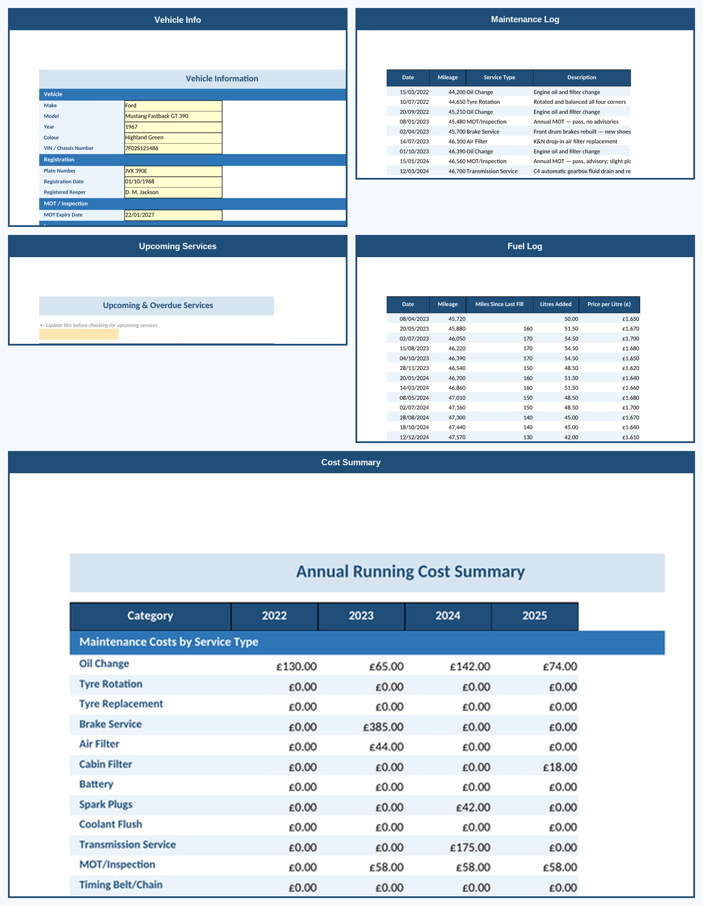
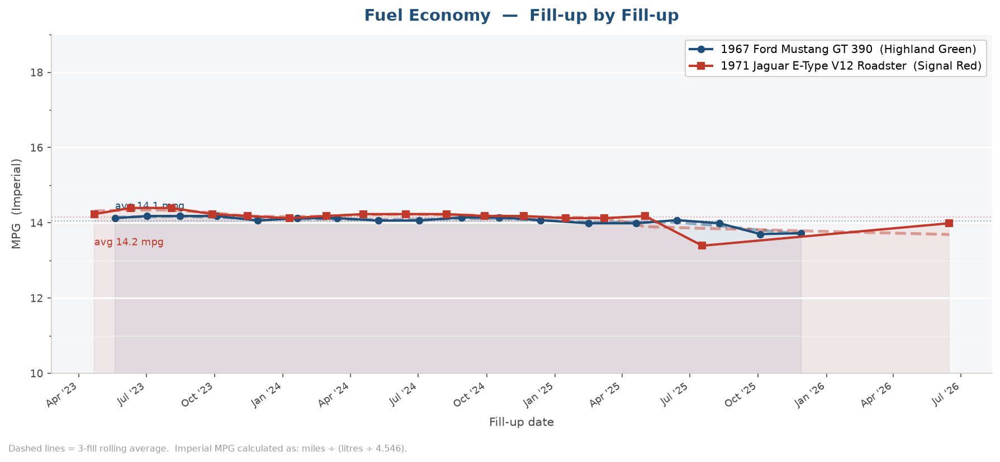
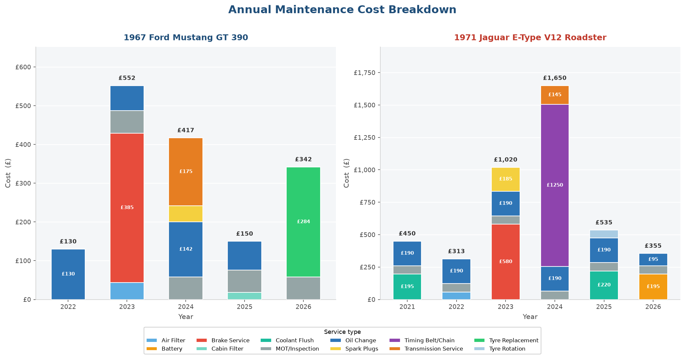

# Vehicle Maintenance Log

A LibreOffice Calc template for tracking every service, monitoring upcoming maintenance, recording fuel economy, and understanding the true annual cost of running your vehicle.

---

## Features

- **Full service history** — log every oil change, MOT, tyre swap, and repair in one place
- **Automatic upcoming-service alerts** — flags anything due within 500 miles or 30 days, highlighted red (overdue) or amber (due soon)
- **Fuel economy tracking** — auto-calculates MPG (Imperial) and L/100km per fill-up, with a trend chart
- **Annual cost summary** — totals maintenance spend by service category and year; compares maintenance vs fuel cost side-by-side
- **Vehicle info sheet** — stores registration, insurance, MOT, road tax, finance, and tyre specs in one place; expiry dates highlighted when approaching
- **Embedded charts** — 4 charts per sample file covering fuel economy, fuel cost, annual maintenance breakdown by service type, and running cost split

---

## Sheets

| Sheet | Purpose |
|-------|---------|
| `Vehicle Info` | Registration, insurance, MOT, road tax, tyre specs |
| `Maintenance Log` | Full service history with next-due mileage and date |
| `Upcoming Services` | Formula-driven view of services due within 500 mi / 30 days |
| `Fuel Log` | Fill-up records with auto-calculated MPG, L/100km, and a trend chart |
| `Cost Summary` | Annual spend by service category; maintenance vs fuel breakdown |

---

## Requirements

- [LibreOffice](https://www.libreoffice.org/download/download-libreoffice/) 7.0 or later (free, open source, Windows / macOS / Linux)
- The FILTER function used in Upcoming Services requires LibreOffice 7.0+

---

## Getting Started

1. Download `vehicle-maintenance-log.ots`.
2. Double-click the file — LibreOffice opens it as a **new untitled document** (the template is preserved).
3. Save immediately as `my-car-2025.ods` (or any name you like).
4. Fill in **Vehicle Info** first.
5. Enter past services you have records for in **Maintenance Log** — even approximate dates help.
6. Start logging fuel fill-ups in **Fuel Log** from today.
7. Update the current odometer cell on **Upcoming Services** monthly or before long trips.

---

## Sample Files

Two fully populated samples are included using classic car data:

| File | Vehicle |
|------|---------|
| `sample-1967-ford-mustang.ots` | 1967 Ford Mustang Fastback GT 390 — Highland Green |
| `sample-1971-jaguar-etype.ots` | 1971 Jaguar E-Type Series III V12 Roadster — Signal Red |

Both samples demonstrate all sheets, conditional formatting, upcoming-service alerts, and embedded charts.

---

## Preview

### Template Overview

### Fuel Economy Trend

### Annual Maintenance Cost Breakdown

---

## Colour Conventions

| Colour | Meaning |
|--------|---------|
| Light blue background | Input cell — enter data here |
| White background | Formula cell — do not overwrite |
| Red background | Overdue service or expired date |
| Amber background | Due soon (within 30 days / 500 miles) |
| Dropdown arrow | Cell has a validated list of options |

---

## Service Categories

Oil Change · Tyre Rotation · Tyre Replacement · Brake Service · Air Filter · Cabin Filter · Battery · Spark Plugs · Coolant Flush · Transmission Service · MOT/Inspection · Timing Belt/Chain · Windscreen · Bodywork · Other

---

## Licence

Released under the [MIT Licence](LICENSE). Free to use, modify, and distribute.

---

*Built with [LibreOffice Calc](https://www.libreoffice.org/) — free and open source.*
